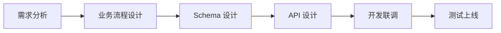

# 业务流程规范（通用模板）

> 适用范围：通用 ｜ 维护人：待定 ｜ 最后更新：2026-09-04

## 目的
项目启动第一步：先画清核心业务流程，再进入 Schema / API 设计，避免边写边返工。

## 写法要求
- 用 mermaid 画流程图，每个节点配一句文字说明
- 标注：角色、触发点、分支、异常 / 兜底路径
- 一个文件一个主流程，避免大而全的巨图
- 主流程确定后，拆出可复用子流程（如登录、审核、通知）

## 产出物
- 通用写法要求见本文件
- 具体项目实例：90-项目实例/<项目>/业务流程.md

## 示例骨架

